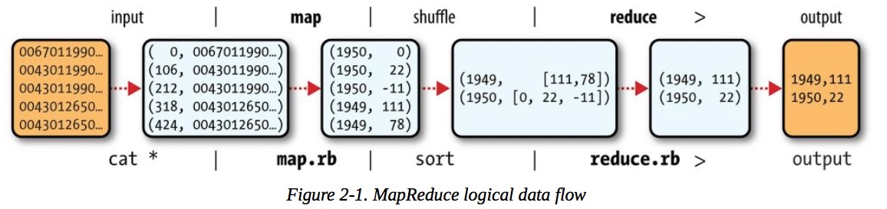
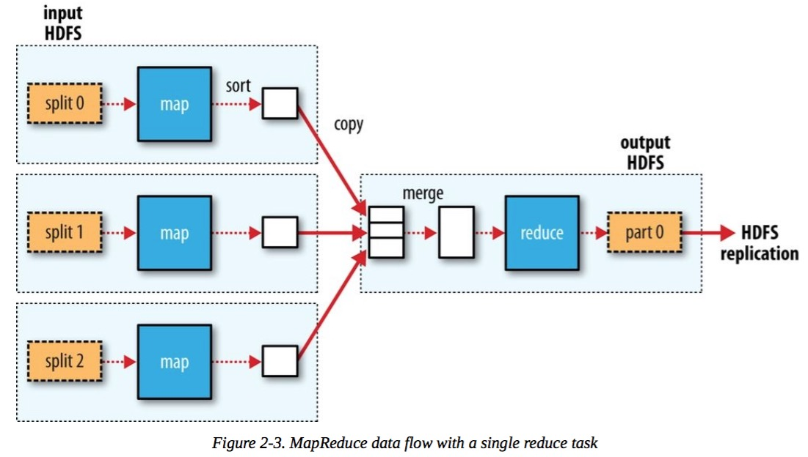
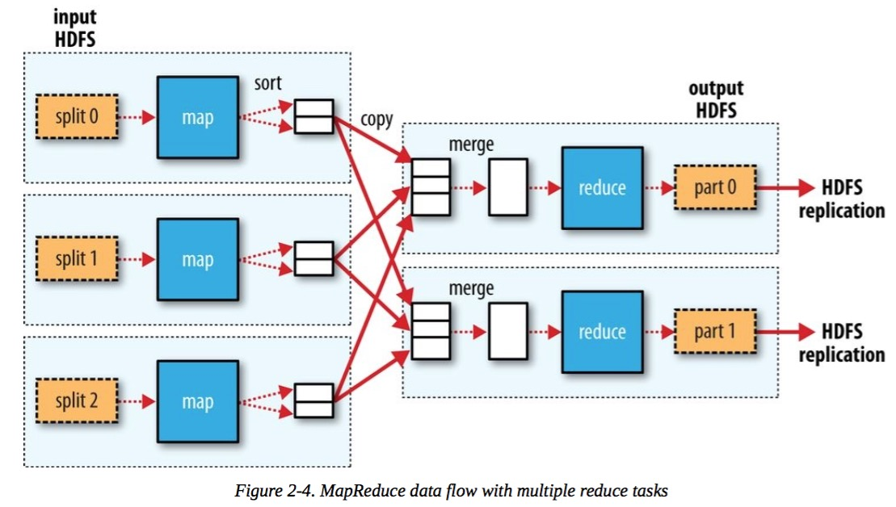

# 运行第一个MapReduce程序

上一节介绍了如何使用vagrant搭建hadoop学习环境。
这一节介绍如何运行第一个MapReduce程序。

书中的示例是以气象局的历史数据作为基础，计算每年的最高温度。


## Mapper

```
public class MaxTemperatureMapper
  extends Mapper<LongWritable, Text, Text, IntWritable> {

  private static final int MISSING = 9999;
  
  @Override
  public void map(LongWritable key, Text value, Context context)
      throws IOException, InterruptedException {
    
    String line = value.toString();
    String year = line.substring(15, 19);
    int airTemperature;
    if (line.charAt(87) == '+') { // parseInt doesn't like leading plus signs
      airTemperature = Integer.parseInt(line.substring(88, 92));
    } else {
      airTemperature = Integer.parseInt(line.substring(87, 92));
    }
    String quality = line.substring(92, 93);
    if (airTemperature != MISSING && quality.matches("[01459]")) {
      context.write(new Text(year), new IntWritable(airTemperature));
    }
  }
}
```

输入文件按照[offset, line]组成KV，Mapper的工作是抽取每行数据中的年份和温度值，输出成\<year, temperature\>的KV。

## Reducer

```
public class MaxTemperatureReducer
  extends Reducer<Text, IntWritable, Text, IntWritable> {
  
  @Override
  public void reduce(Text key, Iterable<IntWritable> values,
      Context context)
      throws IOException, InterruptedException {
    
    int maxValue = Integer.MIN_VALUE;
    for (IntWritable value : values) {
      maxValue = Math.max(maxValue, value.get());
    }
    context.write(key, new IntWritable(maxValue));
  }
}
```
Mapper的输出结果会按照key进行merge，构成\<year,list\<temperature\>\>的KV形成，传递给Reducer。

上面的Reducer接受Mapper的输出，计算每年的最高温度，以\<year, max_temperature\>的形式输出。


## 创建作业

有了Mapper和Reducer后，需要引导程序，来将Mapper和Reducer结合起来，作为一个整体的JOB进行运行。

```
public class MaxTemperature {

  public static void main(String[] args) throws Exception {
    if (args.length != 2) {
      System.err.println("Usage: MaxTemperature <input path> <output path>");
      System.exit(-1);
    }
    
    Job job = new Job();
    job.setJarByClass(MaxTemperature.class);
    job.setJobName("Max temperature");

    FileInputFormat.addInputPath(job, new Path(args[0]));
    FileOutputFormat.setOutputPath(job, new Path(args[1]));
    
    job.setMapperClass(MaxTemperatureMapper.class);
    job.setReducerClass(MaxTemperatureReducer.class);

    job.setOutputKeyClass(Text.class);
    job.setOutputValueClass(IntWritable.class);
    
    System.exit(job.waitForCompletion(true) ? 0 : 1);
  }
}
```

## Combiner

由于Mapper出来的结果是个list，存在本地，然后通过网络传递给Reducer，所以这个list越小越好，由此Combiner诞生了。

Combiner是和Mapper在同一个机器运行的，目的就是尽量减少Mapper的输出。本利中仅仅是为了获得最高温度，所以List可以简化为一个最大值。

```
job.setMapperClass(MaxTemperatureMapper.class);
job.setCombinerClass(MaxTemperatureReducer.class);
job.setReducerClass(MaxTemperatureReducer.class);
```
这里的Combiner借用了Reducer类。


## 运行mapreduce作业

```
$ cd ~/hadoop-book/
$ export HADOOP_CLASSPATH=hadoop-examples.jar
$ hadoop MaxTemperature input/ncdc/sample.txt output
```

## Map Reduce逻辑数据流



## MR 单reduce数据流



## MR 多reduce数据流


